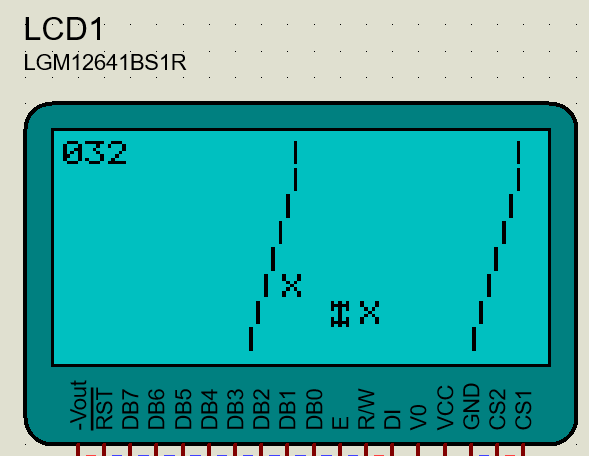

# 🏎️ Jogo de Corrida Stock Car

Este projeto é uma versão de um jogo de corrida do gênero "Stock Car", implementado para o microcontrolador 89S52. O jogo foi desenvolvido inteiramente em linguagem C, utilizando os periféricos simulados na plataforma Proteus para exibir os gráficos e responder aos comandos do jogador.

## 🎮 Sobre o jogo

O jogador controla um carro de corrida que se move pela tela, enquanto a lógica do jogo é processada pelo microcontrolador 89S52. A interface é composta por um display gráfico (GLCD) de 128x64 pixels, que exibe os elementos visuais da corrida, e por teclas direcionais que permitem o controle do veículo. O objetivo é desviar dos obstáculos e se manter na pista o maior tempo possível.

🛠️ Tecnologias e ferramentas utilizadas
- **Linguagem C** para o desenvolvimento do firmware.
- **Keil C** como ambiente de desenvolvimento integrado (IDE).
- **Proteus** para simulação e validação do circuito e do software.
- **Microcontrolador 89S52** como unidade de processamento central.
- **Display Gráfico (GLCD)** 128x64 e teclas direcionais para a interface.

## ▶️ Como rodar
Para executar o jogo no ambiente de simulação Proteus, siga os passos abaixo:

1. Garanta que o Keil C e o Proteus estejam instalados em seu computador.
2. Clone ou baixe os arquivos deste repositório.
3. Abra o projeto do firmware no Keil C e compile-o para gerar o arquivo de programa (.hex).
4. Abra o arquivo de simulação do circuito (.pdsprj) na plataforma Proteus.
5. Dentro do Proteus, clique com o botão direito sobre o microcontrolador 89S52 e selecione "Edit Properties".
6. No campo "Program File", carregue o arquivo .hex que foi gerado pelo Keil C.
7. Inicie a simulação clicando no botão "Play" (ícone de triângulo) na barra de ferramentas.
8. O jogo será exibido no display GLCD virtual. Use as teclas direcionais para jogar.

## 📷 Captura de tela

## 👨‍💻 Autores

- **Leonardo Ryuiti Miasiro**
- **Pedro Marchi Nunes**

Estudantes de **Engenharia da Computação** na **Universidade Federal de São Carlos (UFSCar)**.

Este projeto foi desenvolvido no **Departamento de Computação da UFSCar**, como trabalho prático da disciplina **Arquitetura de Alto Desempenho**, ministrada pelo professor **Emerson Carlos Pedrino**.